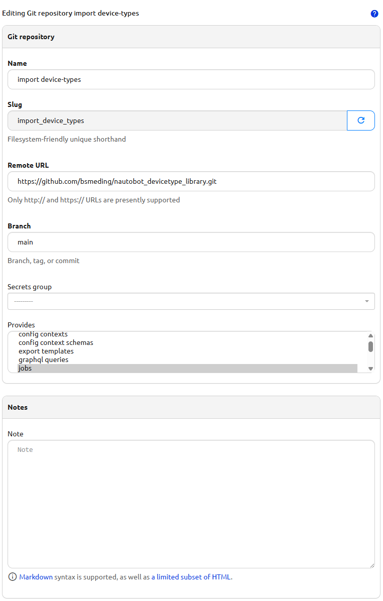
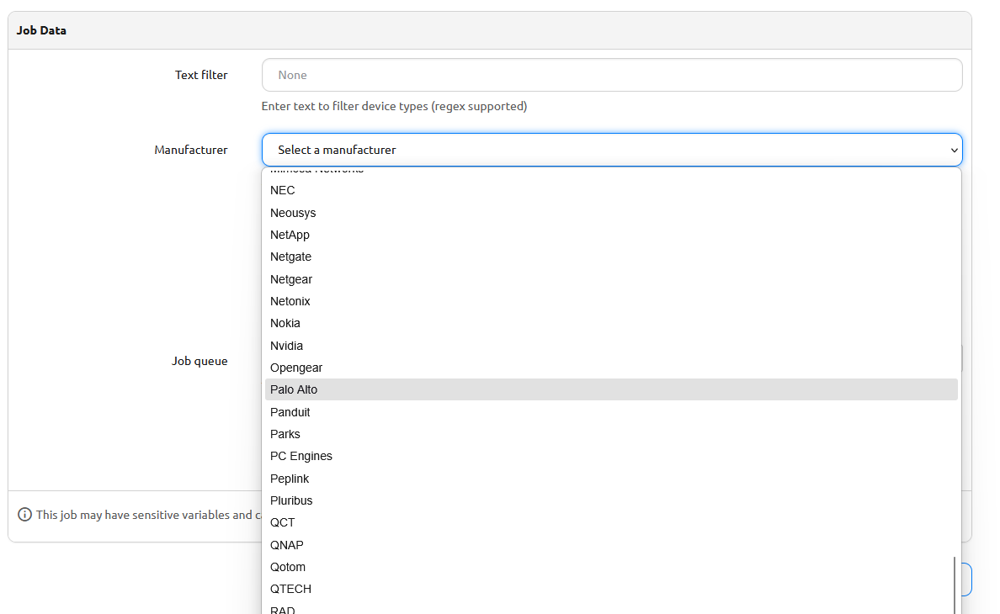
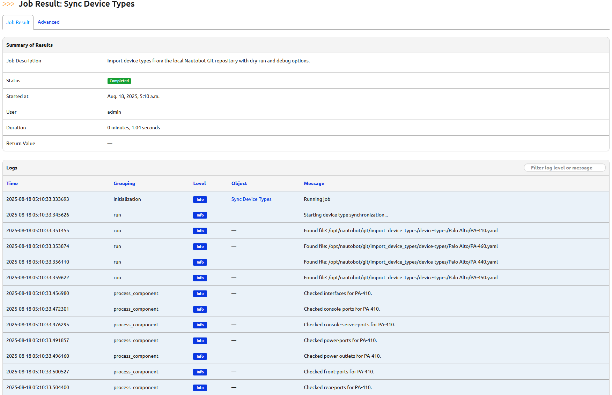
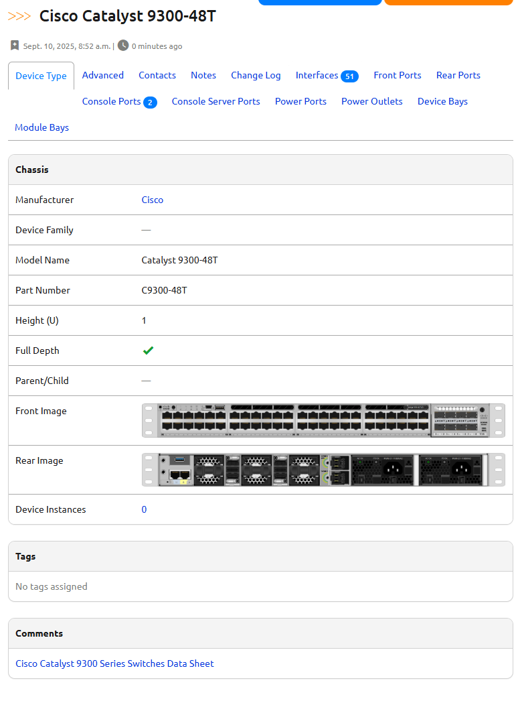

# Nautobot Device Type Library

[](https://github.com/bsmeding/nautobot_devicetype_library/blob/main/LICENSE)
[](https://github.com/bsmeding/nautobot_devicetype_library)
[](https://github.com/bsmeding/nautobot_devicetype_library)

A comprehensive library of device type definitions for [Nautobot](https://github.com/nautobot/nautobot), featuring **4,410 device types** from **224 manufacturers**. This library includes a built-in Nautobot job for easy synchronization without manual copy-pasting.

## Why automate device-type import?

Manually creating device-types in Nautobot is tedious and error-prone, especially for complex devices with many interfaces, modules, and console ports. By using a job that reads device-type YAML files (such as those from the nautobot-device-type-library), you can:

* **Save time:** Import dozens or hundreds of device-types in seconds.
* **Reduce errors:** YAML files are version-controlled and community-maintained.
* **Stay up-to-date:** Easily sync new or updated device-types as vendors release new hardware.

## How it works

The included Nautobot Job (`SyncDeviceTypes`) scans the device-type YAML files in the repository. You can filter by manufacturer (vendor) and/or a text search (supports regex) to only import the device-types you need.

* **Dry-run mode:** See what would be imported/updated before making changes.
* **Commit mode:** Actually create or update device-types in your Nautobot instance.

The job will:
1. List all available manufacturers (vendors) based on the folder structure.
2. Allow you to filter device-types by name or regex.
3. Import the selected device-types, including interfaces, console ports, and module bays.

## Example: Importing Cisco Catalyst 9300

Suppose you want to import only Cisco Catalyst 9300 device-types:

1. In the job form, select manufacturer: `cisco`
2. In the filter field, enter: `9300`
3. Run in dry-run mode to preview.
4. If the results look good, run again with commit enabled.

## How to Get Started

### 1. Add the Git Repository

* Go to **Extensibility** → **Git repositories** in Nautobot.
* Click **Add** and enter the repo URL:  
`https://github.com/bsmeding/nautobot_devicetype_library.git`
* Click **Dry-Run + Sync** to pull the device-types.


*Adding the device-type library as a Git repository in Nautobot.*

### 2. Enable Job

* Go to **Jobs** → **Jobs** in Nautobot.
* Find **Sync device types** Job and click Edit
* Find **Enabled** and select this Enable

### 3. Launch the Job

* Navigate to **Jobs** in Nautobot.
* Find and select the `Sync Device Types` job.
* (Optional) Enter a search filter or select a manufacturer.
* Run in **dry-run** mode first to preview changes.
* Start Dry-Run
* Results Dry-Run
* If satisfied, run again with **commit** enabled to import device-types.


*Example: Selecting manufacturer and filter in the job form.*


*Running the Sync Device Types job with filter and manufacturer selection.*

> **Tip:** Please DO filter otherwise ALL devices will be added

### 4. Verify Imported Device Types

* Go to **Devices** → **Device Types** to see the imported device-types.
* You can now use these when creating new devices in Nautobot.


*Imported device-types now available in Nautobot.*

## Library Statistics

- **Device Types**: 4,410 YAML files
- **Manufacturers**: 224 vendors
- **Coverage**: Major networking vendors including Cisco, Juniper, Arista, HP/HPE, Dell, Fortinet, and many specialized manufacturers

## 🔄 NEW: Device Component Synchronization

In addition to importing device types, this repository now includes a powerful **Device Component Sync** job that synchronizes existing devices with their device type definitions.

### What it does

- **Compare** devices against their device type templates
- **Add** missing components (interfaces, ports, etc.) to devices
- **Remove** extra components not defined in the device type
- **Protect** connected and configured components from deletion
- **Report** detailed changes and differences

### Common use cases

1. **Initial device provisioning**: Automatically add all interfaces when creating a new device
2. **Device type updates**: Sync existing devices after updating a device type template
3. **Cleanup**: Remove components that don't match the device type
4. **Audit**: Compare devices against templates without making changes

### Quick example

```
Job: Sync Device Components
Device Type: Cisco Catalyst 9200L-48P-4G
Sync Mode: Add missing components
Component Types: Interfaces
Result: All missing interfaces added to matching devices
```

### Features

- ✅ **Safe by default**: Diff mode shows changes without applying them
- ✅ **Smart protection**: Won't remove components with cables or configurations
- ✅ **Bulk operations**: Process multiple devices efficiently
- ✅ **Detailed reporting**: JSON export for audit and compliance
- ✅ **Transaction safety**: Changes are rolled back on errors

📖 **[Read the full Device Sync Guide](docs/DEVICE_SYNC_GUIDE.md)** for detailed usage instructions and examples.

## Customizing or Extending

You can fork the repository and add your own device-type YAML files, or contribute improvements upstream. The job will automatically pick up any new files you add to the `device-types/<manufacturer>/` folders.

## Troubleshooting

* **Device-types not appearing?**  
 Double-check your filter and manufacturer selection. Try running with no filter to see all available device-types.
* **Errors on import?**  
 Check the Nautobot job logs for details. Invalid YAML or missing required fields can cause failures.
* **Need more device-types?**  
 Contribute to the [nautobot-device-type-library](https://github.com/bsmeding/nautobot_devicetype_library) or add your own YAML files.

## Security & Best Practices

* Always review device-type definitions before importing, especially from third-party sources.
* Use dry-run mode to preview changes.
* Keep your device-type library up-to-date for new hardware and bugfixes.

## Device Type YAML Format

Each device type definition **must** include at minimum:

```yaml
manufacturer: Cisco
model: C9200L-48P-4G
```

### Optional Fields

- `part_number`: Alternative representation of the model number (e.g. SKU)
- `u_height`: Height in rack units (default: 1)
- `is_full_depth`: Whether device consumes both front and rear rack faces (default: true)
- `front_image` / `rear_image`: Indicates presence of elevation images
- `subdevice_role`: `parent` or `child` device
- `comments`: Additional comments for the device

### Component Definitions

Supported component types:
- `console-ports`: Physical console connectivity
- `console-server-ports`: Remote console access
- `power-ports`: Power supply connections
- `power-outlets`: PDU outlets
- `interfaces`: Network interfaces
- `front-ports` / `rear-ports`: Pass-through connections
- `device-bays`: Slots for child devices

For detailed component documentation, see the [Nautobot documentation](https://docs.nautobot.com/projects/core/en/stable/user-guide/core-data-model/dcim/).

## How to Contribute a New Device Type

Did you notice a device type missing from the library? You can help improve the ecosystem!

1. **Fork the Repository**  
 Go to [nautobot_devicetype_library](https://github.com/bsmeding/nautobot_devicetype_library) on GitHub and click **Fork**.

2. **Add Your Device Type YAML**
3. Clone your fork locally.
4. Add your device type YAML file in the correct manufacturer folder under `device-types/`.
5. Follow the device-type YAML format guidelines.

6. **Commit and Push**
7. Commit your changes with a clear message, e.g.  
`Add device type: Cisco Catalyst 9500-24Y4C`
8. Push to your fork.

9. **Open a Pull Request**
10. Go to your fork on GitHub.
11. Click **Compare & pull request**.
12. Describe your addition and submit the PR.

Your contribution will be reviewed and, once approved, merged into the main library for everyone to use!

> **Tip:** If you're unsure about the YAML format, check out existing device types or open an issue for help.

## Resources

* [nautobot-device-type-library on GitHub](https://github.com/bsmeding/nautobot_devicetype_library) (source of my fork, what is forked from Netbox device_type library)
* [Nautobot documentation: Device Types](https://docs.nautobot.com/projects/core/en/stable/user-guide/core-data-model/dcim/devicetype/)
* [How to write device-type YAML files](https://docs.nautobot.com/projects/core/en/stable/user-guide/core-data-model/dcim/devicetype/)

## License

This project is licensed under the Apache License 2.0 - see the [LICENSE](LICENSE) file for details.

---

**Made with ❤️ for the Nautobot community**

For more NetDevOps content, visit [netdevops.it](https://netdevops.it)